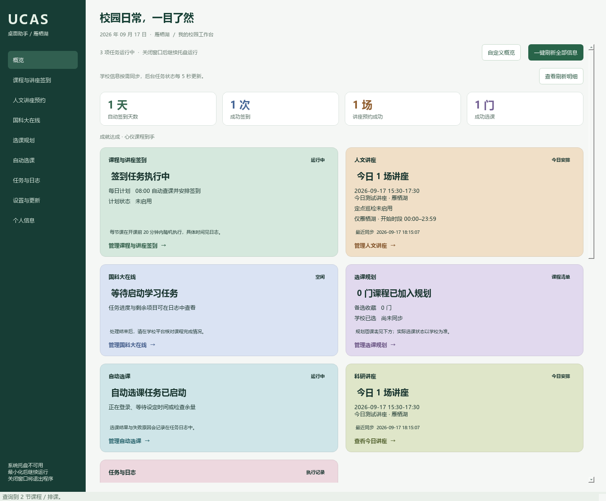
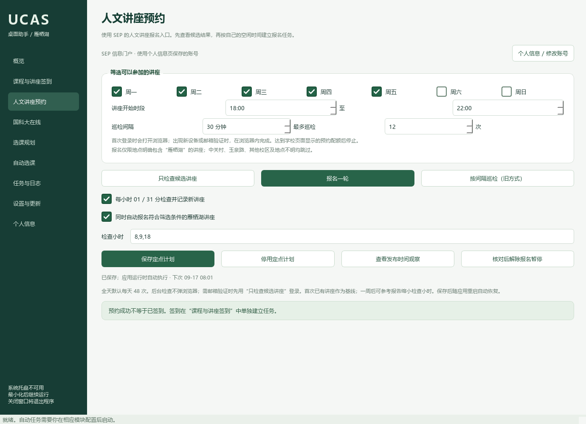
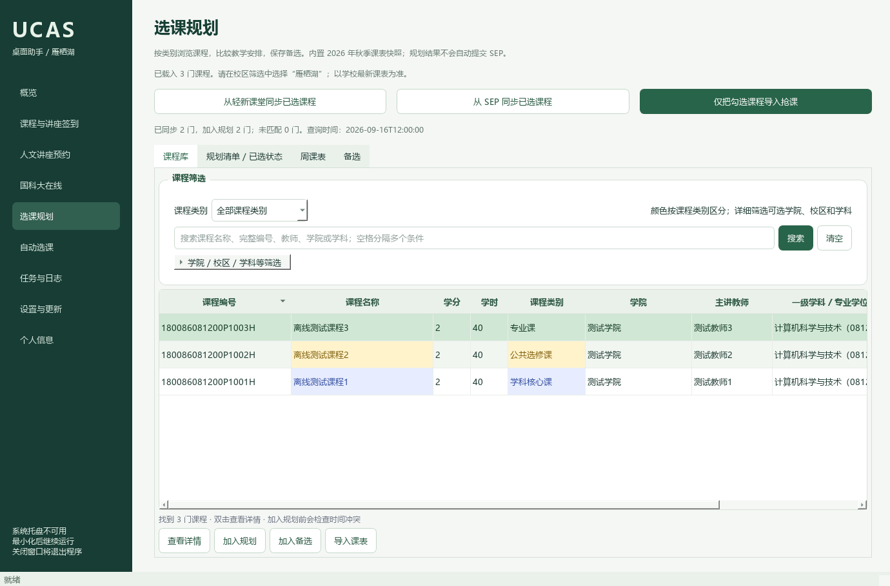
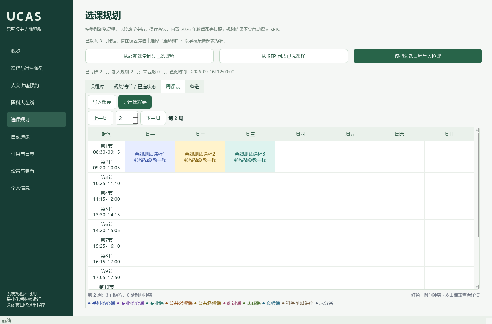
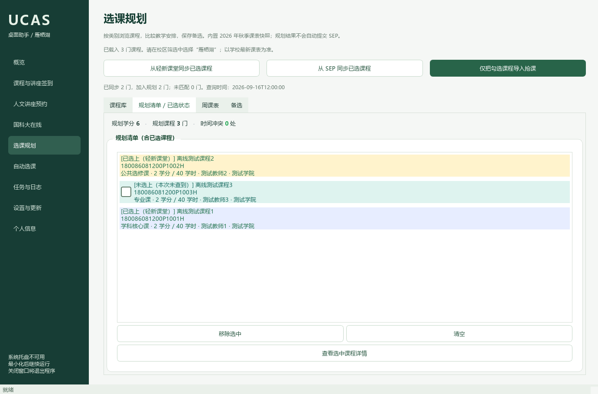
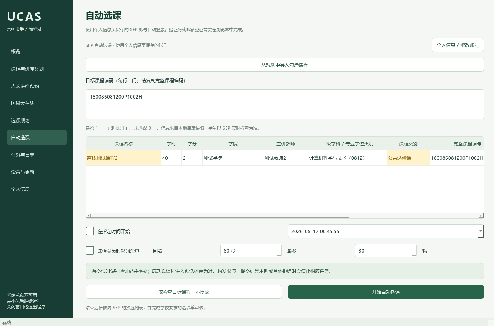
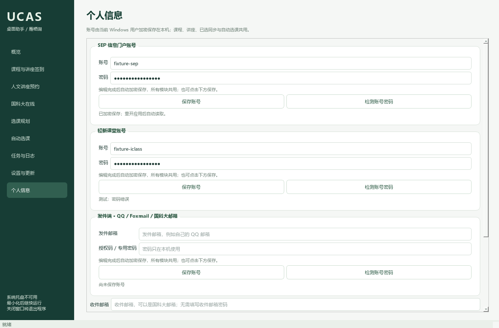

<p align="center"></p>

# UCAS 桌面助手

面向国科大集中教学场景的 **Windows / macOS / Linux 桌面集成工具**：把轻新课堂签到、讲座预约、选课规划、选课自动化及国科大在线视频/文档任务放在同一界面，支持系统托盘后台运行。

## 免安装便携版（推荐普通用户）

前往 **[GitHub Releases 下载 Windows x64 ZIP](https://github.com/zhangzhendan-Berkeley/UCAS-Desktop/releases/latest)**，全部解压后双击 **UCAS桌面助手.exe**。已内置 Python、Node 与所需依赖，不用安装开发环境，不用配置环境变量，也不用执行下面的源码安装命令。

- 保留解压后的整个文件夹，不要只复制 EXE，也不要在压缩软件里直接启动。
- 首次进入“个人信息”填写自己的账号；发行包没有任何人的账号或登录状态。
- 人文讲座预约与自动选课：在“设置与更新”点击 **一键启用讲座预约与抢课**，App 从上游仓库自动下载固定版本并校验、准备组件。
- Windows 10/11 x64；浏览器任务优先使用系统 Edge，否则使用 Chrome，首次 SEP 浏览器任务可能自动联网下载对应驱动。
- 使用、迁移、升级和构建说明见 **[便携版说明](docs/便携版说明.md)**。完整源码与各项许可随包提供。

下面的源码安装说明供开发者或需要自行修改的用户使用。

这是个人维护的非官方项目。默认校区为雁栖湖；功能依赖学校页面和接口，**本地测试通过不代表你的学校账号已验证成功**。首次使用请先查询、预览，再核对学校记录。仅在本人有权操作的账号及学校允许的场景使用。

Linux 支持已加入源码主分支（需要 Python 3.10–3.12、Node.js 22+、Git、图形会话，以及 Chrome/Chromium/Edge）。请先阅读 **[Linux 安装与运行](docs/Linux安装.md)**：

```bash
python3.12 scripts/setup.py
./启动linux.sh
```

Linux 账号通过已解锁的 Secret Service / KWallet 系统密钥环保存；不回退到明文文件。无桌面的服务器需配置图形与 D-Bus 会话，不能直接当作纯命令行服务运行。Linux 暂不提供独立便携包；v0.4.0 发布标签不含这次更新，请使用主分支源码。



## 主分支修复：讲座分页与登录验证码

讲座日程查询按北京时间逐页读取今天及之后的场次，遇到更早日期或最后一页停止；概览一键刷新、人文/科研日程与科研时间表共用同一流程。翻页卡住、日期无法识别或查询不完整时保留旧数据，并报告错误。

修复讲座验证码识别脚本依赖启动目录的问题。识别未完成时保留浏览器，最多等待 10 分钟供用户输入验证码并点击登录；概览显示等待提示。SEP 账号检测与已选同步遇到验证码时也会等待手工完成，不把验证码错误误判为密码错误。更新源码后需再次运行安装脚本，以应用讲座模块补丁。上述修复未包含在旧的 v0.4.0 发布包中。

## v0.4.0：macOS 源码运行支持

- macOS 13+ 可从源码安装，支持菜单栏后台运行、原生钥匙串保存账号、Edge / Chrome 浏览器及任务子进程停止。详见 **[macOS 安装与运行](docs/macOS安装.md)**。
- Windows 继续提供免安装 ZIP；macOS 暂无 `.app` / `.dmg`，不要使用 Windows ZIP。
- 手机面板支持手动指定自己的桌面 API 地址；地址变更时断开旧连接并清除旧密钥，需要重新连接。
- 保留 v0.3.3 的课程调度、主页彩色课表、一键刷新和邮件提醒；增加 Windows / macOS 的自动回归检查。
- 感谢代码提交署名 [cuizixian0328](https://github.com/zhangzhendan-Berkeley/UCAS-Desktop/commit/010c2ed9e703) 和 PR 提交账号 [@zihenghe04](https://github.com/zihenghe04)，贡献见 [PR #1](https://github.com/zhangzhendan-Berkeley/UCAS-Desktop/pull/1)。

## v0.3.3：课程签到随机时间

每日计划和勾选课程任务，均为每节课在开课前 20 分钟内随机选定一次执行时间，精确到秒并保存；重启沿用同一时间，旧“提前 5 分钟”设置不再生效。日志中的 `iclass.scheduled` 显示各节计划时间。已开课或重启时错过计划时间，仍按原规则补查；已结束课程不提交。升级需退出旧进程并重新打开，正在运行的旧任务不会自动切换。

## v0.3.2：主页课表分类配色

主页周课表与选课规划共用课程类别颜色、连续节次课程块及红色冲突提示；今日课程按类别着色，签到状态单独显示。详见 [课表配色示例](docs/仪表盘与邮件提醒.md)。

## v0.3.1：一键刷新与更清晰的概览

- **一键刷新全部信息**：读取今日课程、学校已选课程、人文 / 科研讲座列表和两类有效听讲次数。刷新期间留在概览，每项独立报告结果，失败时保留上次数据。
- 概览采用关键数字、模块状态、详细安排分层显示，卡片颜色更清晰；刷新明细可展开，已有布局与自选颜色保留。
- 修复缺少 `ucasdesk.portable` 时被误报为未填写 SEP 账号的问题；维护者更新包改为完整代码包并检查模块依赖。
- 改善 QQ SMTP 授权码登录兼容性，区分连接、认证和提交失败；服务器已接受邮件后，断开连接不再误判为发送失败。

## v0.3.0：可定制概览与消息提醒

概览展示后台计划、运行状态、今日课程、人文/科研讲座日程、规划周课表和累计成果；卡片可选择显示、信息量和颜色。签到与日志按状态着色，大部分关键信息可选中复制。

个人信息中分别设置 **发件邮箱和收件邮箱**，支持 QQ → 国科大邮箱；按需勾选预约成功、选课成功、任务失败、慕课本轮结束和签到成功提醒。密码/授权码仅在本机加密保存。

**[完整操作：仪表盘、自定义布局、两端邮箱、提醒开关、成就与讲座筛选](docs/仪表盘与邮件提醒.md)**。已有用户升级后保留原时段；需要下午场时在人文讲座页勾选“全天”并保存定点计划。

## 功能与边界

| 模块 | 提供的能力 | 当前限制 |
|---|---|---|
| 课程签到 | 查询课表、选择排课、定时执行、跳过已签到课程 | 支持每日 08:00 查询并安排当天课程；应用需保持运行 |
| 讲座签到 | 轻新课堂同协议二维码/7 位排课 ID、立即或定时执行 | 未验证真实讲座二维码；校园卡、人脸和其他协议未适配 |
| 人文讲座预约 | 仅雁栖湖，按星期/开始时段筛选、报名、01/31 分检查及发布时间观察 | 可选外部模块；需要 SEP 登录，有时需要邮箱验证 |
| 选课规划 | 分类配色、多条件查询、课程详情、备选、周课表、冲突检测、已选同步与勾选导入抢课 | 上游 2026 秋季课表快照，需按学期更新；规划不是实际选课 |
| 自动选课 | 指定课程、定时开始、满员后有界轮询、预选结果核对 | 可选外部模块；使用共享 SEP 账号；必要时手工完成验证，不能保证抢到名额 |
| 国科大在线 | 已适配英语慕课的视频、PDF 处理及剩余任务检查 | **不自动完成测验、作业或考试，不承诺整门课自动通过**；基于 2026 春季页面 |
| 后台与手机 | 关闭/最小化进托盘、状态日志、手机只读面板 | 电脑必须保持运行；没有原生 iOS IPA |
| 扩展与更新 | 固定版本清单、适配器接口、只读 API v1、上游更新检查 | 新版下载到暂存区，需人工验证后替换 |

## 目录

- [安装](#安装)
- [启动与后台运行](#启动与后台运行)
- [各功能操作](#各功能操作)
- [账号、日志与手机面板](#账号日志与手机面板)
- [常见问题](#常见问题)
- [开发与维护](#开发与维护)
- [参考与致谢](#参考与致谢)
- [许可证](#许可证)

## 安装

macOS 用户请阅读 [macOS 安装指南](docs/macOS安装.md)，Linux 用户请阅读 [Linux 安装指南](docs/Linux安装.md)；以下为 Windows 源码安装步骤。

### 1. 环境要求

- Windows 10/11 **64 位**，Microsoft Edge 或 Google Chrome。
- [Python](https://www.python.org/downloads/windows/) **3.10–3.12 x64**。创建独立 `.venv`；初始集成测试版本为 3.10.19。
- [Node.js](https://nodejs.org/) **22 及以上**，建议 24 LTS，需包含 npm。
- [Git for Windows](https://git-scm.com/download/win)。
- 网络可访问 GitHub、PyPI、npm 和所需学校入口。首次 Selenium 运行可能需要下载与 Edge 匹配的驱动。

安装 Python/Node/Git 后重新打开 PowerShell，确认：

```powershell
python --version
node --version
git --version
```

### 2. 获取本项目

```powershell
git clone https://github.com/zhangzhendan-Berkeley/UCAS-Desktop.git
cd UCAS-Desktop
python scripts/setup.py --check
```

安装器不会索取学校密码，也不会自动报名、选课或签到。

### 3. 选择安装范围

**默认安装**：签到、规划、慕课及桌面功能。

```powershell
python scripts/setup.py
```

**另加人文预约与自动选课**：这两个上游快照未附独立 LICENSE，先阅读 [第三方来源及许可边界](THIRD_PARTY.md)，再选择从原仓库获取：

```powershell
python scripts/setup.py --with-external-modules
```

两种方式均会创建 `.venv`、安装 Python 依赖、按 `modules.json` 下载固定提交到 `vendor/`、安装所需 Node 依赖、生成图标和 Windows 启动器。外部依赖不随本仓库源码分发。讲座模块会应用已记录的本地适配补丁；慕课处理函数在安装时生成。

安装中断后可重新运行相同命令。若已有外部目录来源或提交与清单不符，安装器会停止，不自动覆盖你的修改。

### 4. 启动与快捷方式

双击生成的 **`UCAS桌面助手.exe`**；也可运行：

```powershell
.\.venv\Scripts\python.exe app.py
```

创建桌面快捷方式：

```powershell
.\.venv\Scripts\python.exe scripts/build_launcher.py --shortcut
```

EXE 是小型启动器，**不是独立免安装包**。必须保留整个工程、`.venv` 和安装后的 `vendor/`；移动目录后建议重新安装环境并生成快捷方式。本公开版使用系统 Node，无需作者电脑上的相邻项目目录。

## 启动与后台运行

- 点击 **×** 或最小化：窗口隐藏到右下角系统托盘，已有任务继续执行。
- 在右下角 **↑ 隐藏图标** 中找到绿色 U＋勾号图标，单击/双击即可打开窗口。
- 再次双击桌面快捷方式，会唤醒现有窗口，不重复创建任务进程。
- 悬停图标可查看运行数量；右键菜单可打开“任务与日志”。
- 选择 **退出程序（停止自动任务）** 才会完全退出；系统托盘不可用时会回退为关闭退出，并在侧栏提示。
- 电脑休眠、关机、注销或断网时无法正常继续任务。当前没有 Windows 开机自启。已保存的后台计划会随应用重启恢复；课程重新查询当天课表并用提交记录去重，讲座仅执行当前或下一个时点，不补发错过的检查。普通手工任务不自动恢复。

## 各功能操作

### 1. 课程自动签到

#### 每日 08:00 自动安排（推荐）

1. 在“个人信息”填写轻新课堂账号密码，编辑完成后自动加密保存。
2. 勾选“每天 08:00 自动查课表并安排签到”，点击 **保存每日计划**。
3. 以后每天按电脑本地时间 08:00 查询当天课表，将所有未结束、未签到的排课加入定时任务；每节首次执行时间在开课前 20 分钟内随机选定并保存，不再需要每天手工勾选。请将电脑时区设为北京时间。
4. 08:00 后启动或从休眠恢复会补查今天；不追补已经结束的课程。当天无课则正常结束。只读课表查询失败最多尝试 3 次，间隔 5 分钟；之后等待次日或重启应用重查。
5. 重启应用会重新核对当天课表。本机 SQLite 提交记录按账号和排课 ID 去重；提交前先占用记录，网络结果不明或提交途中退出后不盲目重放，需自行核对学校记录。
6. “停用每日计划”或停止该自动任务会停用后续每日计划；“停止全部任务”也停用所有后台计划。单纯退出应用会保留启用设置，下次打开继续。

后台课表查询结果会显示在任务日志，并更新界面中当天的课程列表。应用退出、关机和休眠期间不执行，不会唤醒电脑。普通课程任务与每日任务共享提交去重记录和随机执行时间。比如 10:00 的课程，首次计划可能为 09:43:27；重启不会重新抽取。若在临近开课时首次建任务，仅在剩余课前时段内选择；已经开课则立即补查。是否允许提前签到由学校决定，尚未开放时按上述有限重试处理，不会伪造成功。手工填写讲座 ID 的定时入口仍按讲座开始时间执行。

#### 手动选择课程

1. 在“个人信息”保存本人轻新课堂学号与密码，再打开“课程与讲座签到”。
2. 选择日期，点击“查询课表”，确认课程、日期与时间正确。
3. 勾选要处理的具体课程。每节在开课前 20 分钟内随机选定执行时间，与每日任务共用同一计划。
4. 点击“为勾选课程建立自动签到任务”。
5. 到达时间后，会校准学校时间并再次查询状态，跳过已签到项。
6. 在“任务与日志”查看返回结果，并到学校系统核对。

仅当 `STATUS=0` 且 `stuSignStatus=1` 才记为成功。每节最多 3 次尝试，仅对明确的时间/过期拒绝至少间隔 2 分钟重试（若尚未开课，下一次不早于开课时间）；课程重试在该最早时点后再增加 0–120 秒随机等待；网络错误和未知结果停止处理。不同任务不会重复加入同一排课。

### 2. 科研/人文讲座签到

科研讲座的查询入口是 [科学前沿讲座预告](https://xkcts.ucas.ac.cn:8443/subject/lecture)。新版 SEP 路径为“个人工作台 → 选课系统 → 科学前沿讲座 → 讲座预告”。

1. 在“个人信息”填写 SEP 账号，再到“课程与讲座签到”点击 **查询科研讲座时间表**（需安装讲座外部依赖）。查询只读取当前列表页，不报名或签到。
2. 查询结束后回到该页，点击 **选择讲座并填入时间**。程序会填入学校显示的实际开始、结束时间，并清空上一场次的二维码/ID。
3. 如果已填写本人轻新课堂账号，可点击 **从轻新课堂自动匹配场次**：查询该日课表，仅在标题、开始和结束时间全部一致且只有一条结果时填入 7 位排课 ID。
4. 匹配失败时，仍需该场现场二维码；选课系统的讲座编号和轻新课堂 `courseSchedId` 不是同一套编号，不能直接互换。当前查询和详情页未发现可靠的公开映射；进一步分析见 [讲座编号验证](docs/讲座编号验证.md)。
5. 确认时间和场次后再点击“建立讲座定时签到任务”。查询、选时间和匹配本身都不会提交签到。

- 讲座出现在课表中：按课程签到操作。
- 讲座未列在课表中：在同页下方粘贴实际二维码链接、输入 7 位排课 ID，或读取二维码图片。
- 即时操作点击“立即签到”；定时操作填写该场开始、结束时间，建立讲座定时任务。
- 当前只识别 `iclass.ucas.edu.cn/app/course/stu_scan_sign.action` 中的 `courseSchedId` 协议；其他链接会被拒绝。

**实际讲座二维码尚未验证。** 不支持刷校园卡、人脸考勤、未知 UUID 链接，也不会自动发现所有讲座的签到场次。不要将预约成功理解为已经签到。

### 3. 人文讲座自动预约

先用 `--with-external-modules` 安装可选依赖。

1. 在“个人信息”保存并检测 **SEP 账号、密码**，再打开“人文讲座预约”。
2. 选择可参加的星期和讲座开始时段，默认周一至周五 18:00–22:00。
3. 先点击“只检查候选讲座”；如果出现新设备或邮箱验证，在弹出的浏览器内完成。
4. 在日志检查候选讲座名称、时间、地点。
5. 确认后选择“报名一轮”，或“按间隔巡检（旧方式）”。默认 30 分钟一次、最多 12 轮，可调整。
6. 达到页面要求的预约数量会停止；结果不明确时也停止，请到学校页面核对。

筛选的是**讲座开始时间**，不是报名开放时间。预约后仍需按要求参加和签到。

新版 SEP 中入口位于 **个人工作台 → 选课系统 → 人文讲座 → 讲座预告**，实际列表为 [人文讲座预告](https://xkcts.ucas.ac.cn:8443/subject/humanityLecture)。程序会从当前菜单获取会话跳转链接，不硬编码个人票据，也不再要求工作台有独立“人文讲座报名”卡片。

如果使用首次发布版本并遇到“未找到人文讲座报名入口”，先退出应用，运行 `git pull --ff-only`，再执行 `python scripts/setup.py --with-external-modules`。安装器支持在旧补丁上追加修复，并兼容 Windows CRLF 文件。

#### 仅报名雁栖湖

所有报名入口（单轮、旧间隔巡检、新定点计划）均要求学校表格的 **讲座地点** 明确包含“雁栖湖”。中关村、玉泉路、混合地点、线上、待定以及只有“教一楼”等无法确认校区的地点均跳过。不会根据讲座名称、主办方或讲者单位推断校区。点击报名之前还会重新核对场次和地点，地点变化则不提交。报名结果不明确时停止该轮剩余报名，以免继续占用其他场次。

#### 每小时 01 / 31 分检查与发布时间观察（推荐）



1. 在“个人信息”保存 SEP 账号；先点击“只检查候选讲座”，如需邮箱/新设备验证，在打开的浏览器中完成。
2. 设置自己能参加的星期与讲座开始时段。这是 **讲座时间筛选**，与下面的“检查小时”不同。
3. 勾选“每小时 01 / 31 分检查并记录新讲座”。需要自动报名时，再勾选“同时自动报名符合筛选条件的雁栖湖讲座”；不勾选则只观察。
4. “检查小时”默认 `0,1,2,...,23`，即每天最多 48 轮，例如 08:01、08:31、09:01、09:31；点击 **保存定点计划**。检查之间不运行浏览器、不持续请求学校网站，后台轮次使用无窗口浏览器。
5. 计划、筛选条件和已触发时点都保存在本机。重启后继续；每个时点最多触发一轮，允许 2 分钟启动宽限。正在运行其他讲座任务时等待，超过宽限跳过，不并发使用同一会话，不补跑关机期间的轮次。
6. 每次成功读取列表，记录实际检查时间、讲座名称、讲座时间、地点和首次可报名时间。**首次检查已有讲座属于基线，不算刚发布。** 以后首次出现或首次开放报名时才加入新增统计；同一场次重复出现、报名按钮文字变化、名额重开均不重复计为首次发布。
7. 点击 **查看发布时间观察** 查看最新报告。满一周后报告提示可以参考时点分布调整“检查小时”，例如 `8,9,12,18`；仍在这些小时的 01 / 31 分查询。不会仅凭一周经过就擅自缩减时段。
8. 观察会记录当前列表页的所有校区，但时点分布只统计雁栖湖；提交还受星期、开始时段、学校配额和上游终态记录约束。达到报名配额仍继续只读观察。

**首次发现时间不是准确发布时间。** 报告保留“上次成功检查—首次发现”的观察区间；半小时取样、分页、补放名额、登录失败和关机都可能影响判断。当前只读取列表当前页，不能保证覆盖全部分页或捕获检查间隔内迅速报满的讲座。

后台需要人工登录验证时该轮失败并记录，下一时点再尝试；先停用计划，用可见浏览器的预览完成验证，再启用。出现报名结果不明或提交过程意外退出时，后续轮次保持只读观察，不重复报名；核对学校实际记录后，停止讲座任务，点击 **核对后解除报名暂停**，再保存启用计划。

数据仅保存在本机：`data/automation.json` 为不含密码的计划，`data/automation-state.json` 为触发记录，`data/sign-ledger.sqlite3` 为签到提交记录，`data/lecture/<账号哈希>/observations.json` 与 `发布时间观察.md` 为观察数据。账号使用 Windows DPAPI、macOS 钥匙串或 Linux 系统密钥环保存，以上数据和日志均不提交到 GitHub。

### 4. 国科大在线视频/文档

1. 打开“国科大在线”，保留平台入口或粘贴自己的课程章节链接。
2. 点击“启动视频 / 文档任务”。
3. 在专用 Edge / Chrome 窗口登录，进入“个人空间 → 课程 → 章节”，打开目标课程任意章节。程序最多等待 10 分钟。
4. 识别到适配页面后处理视频/PDF，并核对服务器任务点状态。
5. 结束后查看日志中的剩余任务。退出码 `2` 表示还有未完成项，不代表课程已通过。
6. 测验、作业、考试及未适配类型仍需自行完成。

逻辑来源为适配 **2026 春季硕士英语**页面的上游项目，不能保证所有学期/课程通用。PC 与 App 学习数据互通，但学校手册要求不要同时使用；电脑处理同一课程时请退出手机端该课程。[学校学生手册](https://foreign.ucas.edu.cn/docs/2025-02/e5c8ee6db8424f718909a11c6307c699.pdf)

### 5. 选课规划

1. 打开“选课规划”，首次导入上游 2026 秋季课表，默认雁栖湖。
2. 在“课程库”搜索名称、完整编号、教师、学院或学科；空格分隔多个条件，要求同时满足。用“课程类别”筛选核心课、公共课等；展开“学院 / 校区 / 学科等筛选”可叠加院系、校区、培养层次和学科条件。“清空”重置全部筛选（包括校区），需要时重新选择雁栖湖。
3. 双击课程打开详情，查看学时、学分、开课学院、主讲教师、类别、一级学科 / 专业学位类别及全部教学安排。点击“加入规划”后检查冲突；不会自动选课。详情中的学科名称按课程编码映射，缺失字段显示“未提供”。
4. 在“规划清单 / 已选状态”查看状态、规划学分和移除课程；移除只影响本地，不会退课。
5. 在“周课表”切换周次、查看安排与冲突。按类别使用统一颜色，相邻连续节次合成课程块；冲突优先显示红色，双击课程块查看详情。通过导出功能保存 CSV、Excel、JSON、PDF。
6. 在“规划清单 / 已选状态”勾选要抢的课程，再点击“仅把勾选课程导入抢课”。不会导入整个规划，也不会重复导入已选上的课程。
7. 暂时没决定的课程可以先“加入备选”，在“备选”标签中查看、移除或加入规划。备选独立持久化，不计入规划学分、不进入周课表、不自动勾选抢课；加入规划后仍保留备选记录，可自行移除。切换课程库时，无法按完整编号和名称匹配的备选仍保留并提示。

初始快照共 2,090 门，雁栖湖筛选 1,499 门。**以学校最新课表为准**；可通过“导入课表”导入 SEP 导出的 xlsx。规划和已选快照只保存在本地。





#### 同步真实已选课程



- **从轻新课堂同步已选课程**：使用“我的课程”只读接口，按实际课程起止日期选取当前课程；不直接信任存在旧年份的学期名称字段。完整课程编码（含班次后缀）和名称唯一匹配后，自动加入本地规划、周课表和冲突计算。
- **从 SEP 同步已选课程**：专用浏览器使用共享账号登录后只读取 `https://xkgo.ucas.ac.cn:3000/courseManage/main` 的已选/预选表，不会进入可选课程目录或提交选课。需要验证码时由本人完成。当前遇到未适配分页会停止并保留旧结果，可改用轻新课堂同步。
- 状态包括 **已选上（轻新课堂）**、**已选上（SEP 预选）**、**未选上（本次未查到）**；尚未同步时显示 **未核实 / 计划选**。轻新课堂可能有同步延迟，SEP 预选不代表审核完成，以学校记录为准。
- 同步结果按账号保存，显示查询时间；修改账号后不会把旧账号结果当成新账号的已选状态。失败或解析不完整时保留上次结果。
- 编码、名称或学期无法匹配的课程会明确列出；不把同名或不同班次的课程自动混用。此类课程暂不绘入周课表，需要更新本地课程库后重新同步。
- 勾选框只控制哪些规划课程导入抢课。已选上的课程保留在周课表，但不可勾选抢课；再次同步发现已经选上后会自动取消该课程的抢课勾选。

### 6. 自动选课与余量轮询

先安装可选外部依赖。

1. 输入完整课程编码，每行一门，或从规划页勾选带入。下方明细自动展示课程名称、学时、学分、学院、主讲教师、一级学科 / 专业学位类别、课程类别、完整编号和已选核对状态；可横向滚动及拖动表头调整列宽，双击查看完整教学安排。重复编号只保留一门。
2. 可指定开始时间；如等待退课名额，启用满员轮询并设置间隔/轮数。
3. 先用“仅检查目标课程，不提交”确认匹配正确。
4. 启动后使用“个人信息”中的 SEP 账号自动登录并进入新版选课主页。出现验证码/邮箱验证时在浏览器中完成，最多等待 10 分钟。
5. 有名额时识别验证码、提交、检查预选列表。请求至少间隔 1 秒，满员轮询至少间隔 30 秒。
6. 限流、登录异常、其他拒绝或结果未知时停止，不无限重复提交。
7. 结束后核对学校预选列表，并完成学校要求的选课单审核。

运行期间不要关闭该任务的专用浏览器。停止任务会结束它所属的浏览器进程。

明细来自**本地课程库快照**，不是实时余量。无法唯一匹配的完整编号会明确提示，不去掉班次后缀猜测其他班级；更新本地课表后重新进入此页可刷新。提交前仍可用“仅检查目标课程，不提交”核对学校当前数据。



## 账号、日志与手机面板

### 个人信息与账号检测



1. 打开侧栏 **个人信息**，分别填写 SEP 邮箱/账号、密码，以及轻新课堂学号、密码。
2. 编辑完成后自动保存；也可以点击各自的 **保存账号**。无需每次启动重新输入，不再分散在业务页面里重复填写。
3. 点击 **检测账号密码**。轻新课堂重新登录验证；SEP 在无旧会话的独立浏览器中重新登录，避免旧 Cookie 把错误密码误判为正确。
4. 学校明确拒绝账号密码时会弹出提示；网络异常、验证码未完成、页面变化会提示“未完成”，不会声称密码正确。
5. 可随时修改，之后启动的模块任务共用更新后的凭据。已经运行的任务仍持有启动时的凭据；需要立即切换时停止并重新启动相应任务。

### 账号与日志

- 密码在本机界面填写，不需要提交给仓库维护者。
- 轻新课堂固定学校接口默认直连，避免无关的 HTTP 代理导致超时，TLS 校验仍开启。确需 HTTP 代理时可在启动前设置 `UCAS_ICLASS_USE_PROXY=1`。
- SEP 与轻新课堂账号统一在 **个人信息** 页维护，使用 Windows DPAPI、macOS 钥匙串或 Linux 系统密钥环保存；填写完整后离开输入框会自动保存，也可点击“保存账号”。重新打开自动读取，旧的已加密账号直接沿用。
- `data/accounts.dpapi` 绑定当前 Windows 用户；浏览器会话另存在 `data/browser-*` 和 `data/lecture/`，不等同于 DPAPI 加密账号文件。
- 任务状态、计划、设置在 `data/`；日志在 `logs/`。这两个目录已加入 `.gitignore`。
- 日志按已知账号、密码及常见令牌脱敏；提交 Issue 前仍需检查截图和文本，删除学号、姓名、课程私人链接及会话信息。
- “已结束”只表示脚本正常完成本轮，具体是否报名/签到/选课成功，以日志解析结果和学校记录为准。

### iPhone 只读面板

1. 在“设置与更新”允许同一局域网访问，保存后**从托盘退出并重开**应用。
2. 手机和电脑连接可信、可互访的局域网。
3. 点击“复制手机面板地址”，在 iPhone Safari 打开。
4. 分享 → 添加到主屏幕，即可查看任务状态。

地址包含访问密钥，只供本人设备使用。默认 API 仅监听 `127.0.0.1:8765`；启用局域网后使用 HTTP，不应暴露到公网或不可信网络。若校园网络隔离设备，可换用可信家庭网络或热点。

这是只读网页，任务仍在桌面端执行。**没有原生 IPA，也没有 iPhone 后台自动化**。更多说明见 [iOS 文档](docs/iOS说明.md)。

## 常见问题

| 问题 | 排查方式 |
|---|---|
| 找不到 Python/Node/Git | 安装后重开终端，运行 `python scripts/setup.py --check`；不要用 Python 3.13+ 安装当前依赖快照 |
| pip 或 npm 下载失败 | 检查网络/代理；恢复网络后重跑安装器；不建议关闭 TLS 校验 |
| EXE 打不开 | 用 `启动调试.cmd` 查看输出，检查 `.venv` 与依赖是否完整；看 `logs/startup-error.log` |
| 提示未找到 csc.exe | 可先用 `启动调试.cmd`；启动器构建需要 Windows .NET Framework C# 编译器 |
| 人文预约/自动选课提示未安装 | 阅读第三方说明后执行 `python scripts/setup.py --with-external-modules` |
| Edge/WebDriver 启动失败 | 更新 Edge；确认首次驱动下载可联网。本项目已对本地 WebDriver 地址设置 `NO_PROXY` |
| 登录成功但找不到章节或课程 | 先确认目标页面；学校结构可能已变，保留脱敏错误与版本信息，不要直接无限重试 |
| 讲座二维码不支持 | 必须是已适配 iClass 协议；只提供脱敏的协议结构用于排查，不要公开完整私人二维码 |
| 关闭窗口后没反应 | 正常：应用在右下角 ↑ 内运行。再次打开快捷方式或点击托盘图标 |
| 手机打不开 | 确认已启用局域网访问且真正退出重启，检查设备互访、防火墙、端口；程序不会自动修改防火墙 |
| 程序提示操作结束，学校没记录 | 检查日志中的服务器返回并以学校记录为准；未知结果不会被当作成功 |
| 电脑重启后任务没继续 | 先打开应用；只有已启用的后台计划自动恢复，且需在个人信息保存对应账号。普通手动任务仍需重新建立 |

## 开发与维护

主要结构：

```text
app.py                  应用入口与单实例锁
ucasdesk/               界面、托盘、凭据、任务、接口和更新逻辑
adapters/               各模块子进程入口，JSON 通过 stdin 传入
modules.json            来源、固定 SHA、能力、可选模块标记
scripts/                环境安装、源码准备、启动器构建
patches/                已记录的讲座适配差异与新增测试
assets/                 图标源文件及生成资源
mobile/                 手机只读状态页
tests/                  核心、UI、托盘和浏览器检查
vendor/                 安装时从原作者下载，Git 忽略
data/ logs/ updates/    本地生成，Git 忽略
```

### 检查

```powershell
.\.venv\Scripts\python.exe -m unittest discover -s tests -v
.\.venv\Scripts\python.exe -m compileall -q app.py ucasdesk adapters scripts
# UI 检查会写入测试记录和截图；先从托盘退出普通实例
.\.venv\Scripts\python.exe tests/ui_smoke.py
# 托盘检查用隔离临时数据，需要实际 Windows 桌面
.\.venv\Scripts\python.exe tests/tray_smoke.py
# 安装讲座外部模块后可运行其测试
npm --prefix vendor/ucas-humanity-lecture-bot test
node tests/lecture_portal_smoke.mjs
```

初始本地验证包括 9 项 Python 核心测试、24 项讲座测试、课表与四种导出、浏览器启动、任务停止、关闭/最小化继续运行及跨进程唤醒。CI 在 Windows / macOS / Ubuntu 运行依赖安装、离线核心、界面、浏览器及任务停止检查，Mac / Linux 另验证系统密钥环，**不携带学校账号、不验证真实业务、不代表所有模块端到端可用**。详见 [验证记录](docs/项目筛选与验证.md)。

### 更新与扩展

- 桌面“检查上游新版本”对比固定来源的最新提交。
- “下载更新到暂存目录”只写入 `updates/`，不会自动覆盖已适配版本或执行新代码。
- 更新本集成层前先退出应用、备份 `data/`，再 `git pull --ff-only`；依赖变化时重新运行安装器。
- 更新第三方固定版本时同时维护 `modules.json`、补丁和测试，不要直接覆盖已有 `vendor/`。
- 新平台通过适配器、`Connector` 协议和模块清单接入；HTTP API v1 提供 `/v1/health`、`/v1/modules`、`/v1/jobs`，状态读取要求 Bearer Token，除健康接口外需鉴权。

[维护与接口文档](docs/维护与接口.md) · [贡献说明](CONTRIBUTING.md)

## 参考与致谢

### 社区贡献

- **[cuizixian0328](https://github.com/zhangzhendan-Berkeley/UCAS-Desktop/commit/010c2ed9e703)**（Git 提交署名）：macOS 账号存储、浏览器选择、字体、任务进程、安装说明、手机面板及测试适配；另有缺少讲座模块时的错误提示修正。相关改动已适配到当前版本。
- **[@zihenghe04](https://github.com/zihenghe04)**（PR 提交账号）：通过 [PR #1](https://github.com/zhangzhendan-Berkeley/UCAS-Desktop/pull/1) 提交整合后的 macOS 支持。

上述署名和 PR 账号按 Git / GitHub 实际记录分别列出；本次集成保留原始作者提交，并补充兼容性与安全修复。


感谢原作者公开代码与文档，本项目是在这些工作之上的集成与适配：

| 工作 | 作者/项目 |
|---|---|
| 项目发现与目录整理 | [Littlefish12138/UCAS-on-Github](https://github.com/Littlefish12138/UCAS-on-Github/tree/main/教务系统相关) |
| 轻新课堂签到协议 | [lccipher/UCAS-Course-Sign-in](https://github.com/lccipher/UCAS-Course-Sign-in) |
| 人文讲座自动预约 | [FYTJ/ucas-humanity-lecture-bot](https://github.com/FYTJ/ucas-humanity-lecture-bot) |
| 选课规划器与课表 | [WindFromKadath/UCAS-Course-Selector](https://github.com/WindFromKadath/UCAS-Course-Selector) |
| 分类浏览、备选与界面交互参考 | [Course Planner · ITP 草原上的鱼](https://courseplanner.cysdy.cn/)；本项目以 PySide6 独立实现，未复制网站代码、素材或课程库 |
| 国科大在线英语慕课 | [wendychan03/ucas-mooc-helper](https://github.com/wendychan03/ucas-mooc-helper)，原作 [kejaly/ucas_english_mooc](https://github.com/kejaly/ucas_english_mooc) |
| 新版选课自动化 | [G9B0ND/UCAS-COURSE-SELECTION-SCRIPT](https://github.com/G9B0ND/UCAS-COURSE-SELECTION-SCRIPT)，其声明来源 [lizhuoq/UCAS-Course-selection-script](https://github.com/lizhuoq/UCAS-Course-selection-script) |
| 交叉参考 | MosRat/ucas-iclass-checkin、Littlefish12138/UCAS_Mooc_Helper、tang-ontheway/ucas-mooc-helper、wirsbf/TraintimePda-UCAS、tbjuechen/sep-api |

固定版本、直接/间接归属、修改范围及许可差异见 [THIRD_PARTY.md](THIRD_PARTY.md)。

## 许可证

本项目自行编写的集成代码采用 [GNU AGPL v3（AGPL-3.0-only）](LICENSE)。第三方代码和数据遵循其原始条款；本许可不为缺少明确许可证的外部项目授予再分发权。仓库不包含个人账号、登录会话、运行日志或完整外部项目副本。
