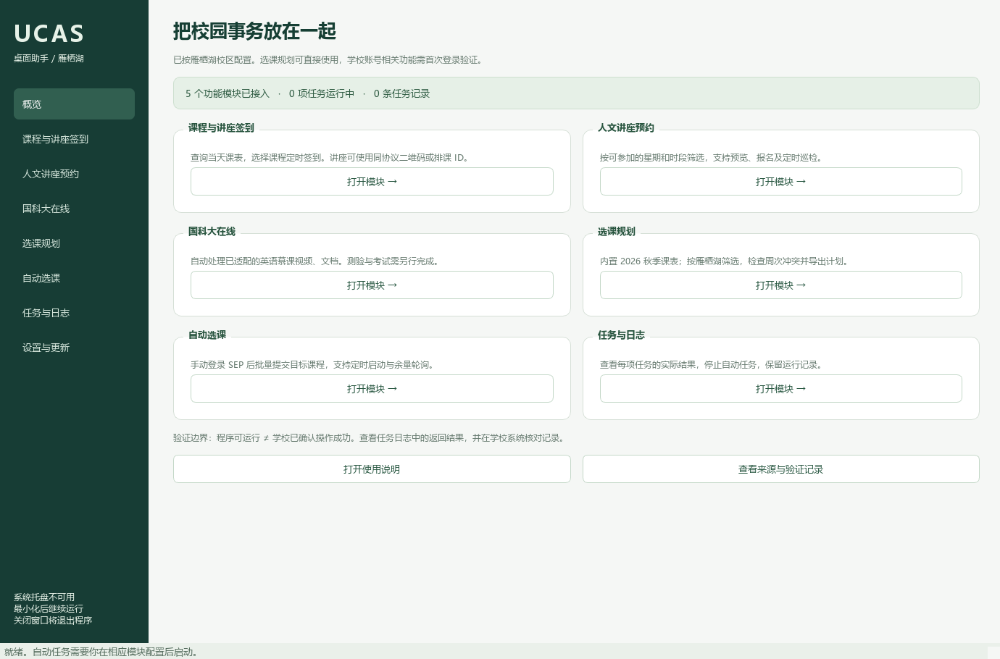
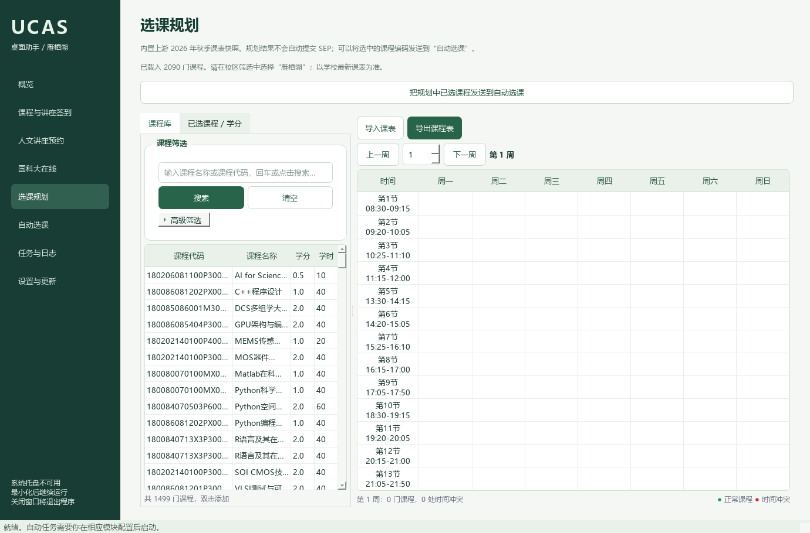

<p align="center"></p>

# UCAS 桌面助手

面向国科大集中教学场景的 **Windows 桌面集成工具**：把轻新课堂签到、讲座预约、选课规划、选课自动化及国科大在线视频/文档任务放在同一界面，支持系统托盘后台运行。

这是个人维护的非官方项目。默认校区为雁栖湖；功能依赖学校页面和接口，**本地测试通过不代表你的学校账号已验证成功**。首次使用请先查询、预览，再核对学校记录。仅在本人有权操作的账号及学校允许的场景使用。



## 功能与边界

| 模块 | 提供的能力 | 当前限制 |
|---|---|---|
| 课程签到 | 查询课表、选择排课、定时执行、跳过已签到课程 | 只处理本次选中的排课，不会每天自动发现并加入全部课程 |
| 讲座签到 | 轻新课堂同协议二维码/7 位排课 ID、立即或定时执行 | 未验证真实讲座二维码；校园卡、人脸和其他协议未适配 |
| 人文讲座预约 | 按星期/开始时段筛选、预览、报名、定时巡检 | 可选外部模块；需要 SEP 登录，有时需要邮箱验证 |
| 选课规划 | 校区筛选、周课表、冲突检测、CSV/Excel/JSON/PDF 导出 | 上游 2026 秋季课表快照，需按学期更新；规划不是实际选课 |
| 自动选课 | 指定课程、定时开始、满员后有界轮询、预选结果核对 | 可选外部模块；需在专用 Edge 手动登录，不能保证抢到名额 |
| 国科大在线 | 已适配英语慕课的视频、PDF 处理及剩余任务检查 | **不自动完成测验、作业或考试，不承诺整门课自动通过**；基于 2026 春季页面 |
| 后台与手机 | 关闭/最小化进托盘、状态日志、手机只读面板 | 电脑必须保持运行；没有原生 iOS IPA |
| 扩展与更新 | 固定版本清单、适配器接口、只读 API v1、上游更新检查 | 新版下载到暂存区，需人工验证后替换 |

## 目录

- [安装](#安装)
- [启动与后台运行](#启动与后台运行)
- [各功能操作](#各功能操作)
- [账号、日志与手机面板](#账号日志与手机面板)
- [常见问题](#常见问题)
- [开发与维护](#开发与维护)
- [参考与致谢](#参考与致谢)
- [许可证](#许可证)

## 安装

### 1. 环境要求

- Windows 10/11 **64 位**，Microsoft Edge。
- [Python](https://www.python.org/downloads/windows/) **3.10–3.12 x64**。创建独立 `.venv`；初始集成测试版本为 3.10.19。
- [Node.js](https://nodejs.org/) **22 及以上**，建议 24 LTS，需包含 npm。
- [Git for Windows](https://git-scm.com/download/win)。
- 网络可访问 GitHub、PyPI、npm 和所需学校入口。首次 Selenium 运行可能需要下载与 Edge 匹配的驱动。

安装 Python/Node/Git 后重新打开 PowerShell，确认：

```powershell
python --version
node --version
git --version
```

### 2. 获取本项目

```powershell
git clone https://github.com/zhangzhendan-Berkeley/UCAS-Desktop.git
cd UCAS-Desktop
python scripts/setup.py --check
```

安装器不会索取学校密码，也不会自动报名、选课或签到。

### 3. 选择安装范围

**默认安装**：签到、规划、慕课及桌面功能。

```powershell
python scripts/setup.py
```

**另加人文预约与自动选课**：这两个上游快照未附独立 LICENSE，先阅读 [第三方来源及许可边界](THIRD_PARTY.md)，再选择从原仓库获取：

```powershell
python scripts/setup.py --with-external-modules
```

两种方式均会创建 `.venv`、安装 Python 依赖、按 `modules.json` 下载固定提交到 `vendor/`、安装所需 Node 依赖、生成图标和 Windows 启动器。外部依赖不随本仓库源码分发。讲座模块会应用已记录的本地适配补丁；慕课处理函数在安装时生成。

安装中断后可重新运行相同命令。若已有外部目录来源或提交与清单不符，安装器会停止，不自动覆盖你的修改。

### 4. 启动与快捷方式

双击生成的 **`UCAS桌面助手.exe`**；也可运行：

```powershell
.\.venv\Scripts\python.exe app.py
```

创建桌面快捷方式：

```powershell
.\.venv\Scripts\python.exe scripts/build_launcher.py --shortcut
```

EXE 是小型启动器，**不是独立免安装包**。必须保留整个工程、`.venv` 和安装后的 `vendor/`；移动目录后建议重新安装环境并生成快捷方式。本公开版使用系统 Node，无需作者电脑上的相邻项目目录。

## 启动与后台运行

- 点击 **×** 或最小化：窗口隐藏到右下角系统托盘，已有任务继续执行。
- 在右下角 **↑ 隐藏图标** 中找到绿色 U＋勾号图标，单击/双击即可打开窗口。
- 再次双击桌面快捷方式，会唤醒现有窗口，不重复创建任务进程。
- 悬停图标可查看运行数量；右键菜单可打开“任务与日志”。
- 选择 **退出程序（停止自动任务）** 才会完全退出；系统托盘不可用时会回退为关闭退出，并在侧栏提示。
- 电脑休眠、关机、注销或断网时无法正常继续任务。当前没有开机自动运行，也不自动恢复上次未完成的提交任务。

## 各功能操作

### 1. 课程自动签到

1. 打开“课程与讲座签到”，输入**本人轻新课堂学号与密码**。
2. 选择日期，点击“查询课表”，确认课程、日期与时间正确。
3. 勾选要处理的具体课程，设置提前时间（默认开课前 5 分钟）。
4. 点击“为勾选课程建立自动签到任务”。
5. 到达时间后，会校准学校时间并再次查询状态，跳过已签到项。
6. 在“任务与日志”查看返回结果，并到学校系统核对。

仅当 `STATUS=0` 且 `stuSignStatus=1` 才记为成功。每节最多 3 次尝试，仅对明确的时间/过期拒绝间隔 2 分钟重试；网络错误和未知结果停止处理。不同任务不会重复加入同一排课。

### 2. 科研/人文讲座签到

- 讲座出现在课表中：按课程签到操作。
- 讲座未列在课表中：在同页下方粘贴实际二维码链接、输入 7 位排课 ID，或读取二维码图片。
- 即时操作点击“立即签到”；定时操作填写该场开始、结束时间，建立讲座定时任务。
- 当前只识别 `iclass.ucas.edu.cn/app/course/stu_scan_sign.action` 中的 `courseSchedId` 协议；其他链接会被拒绝。

**实际讲座二维码尚未验证。** 不支持刷校园卡、人脸考勤、未知 UUID 链接，也不会自动发现所有讲座的签到场次。不要将预约成功理解为已经签到。

### 3. 人文讲座自动预约

先用 `--with-external-modules` 安装可选依赖。

1. 打开“人文讲座预约”，填写 **SEP 信息门户账号、密码**。
2. 选择可参加的星期和讲座开始时段，默认周一至周五 18:00–22:00。
3. 先点击“只检查候选讲座”；如果出现新设备或邮箱验证，在弹出的浏览器内完成。
4. 在日志检查候选讲座名称、时间、地点。
5. 确认后选择“报名一轮”，或“开始定时巡检与报名”。默认 30 分钟一次、最多 12 轮，可调整。
6. 达到页面要求的预约数量会停止；结果不明确时也停止，请到学校页面核对。

筛选的是**讲座开始时间**，不是报名开放时间。预约后仍需按要求参加和签到。

### 4. 国科大在线视频/文档

1. 打开“国科大在线”，保留平台入口或粘贴自己的课程章节链接。
2. 点击“启动视频 / 文档任务”。
3. 在专用 Edge 登录，进入“个人空间 → 课程 → 章节”，打开目标课程任意章节。程序最多等待 10 分钟。
4. 识别到适配页面后处理视频/PDF，并核对服务器任务点状态。
5. 结束后查看日志中的剩余任务。退出码 `2` 表示还有未完成项，不代表课程已通过。
6. 测验、作业、考试及未适配类型仍需自行完成。

逻辑来源为适配 **2026 春季硕士英语**页面的上游项目，不能保证所有学期/课程通用。PC 与 App 学习数据互通，但学校手册要求不要同时使用；电脑处理同一课程时请退出手机端该课程。[学校学生手册](https://foreign.ucas.edu.cn/docs/2025-02/e5c8ee6db8424f718909a11c6307c699.pdf)

### 5. 选课规划

1. 打开“选课规划”，首次导入上游 2026 秋季课表，默认雁栖湖。
2. 搜索课程或使用高级筛选选择院系、校区、培养层次。
3. 双击课程加入计划，切换周次查看安排与冲突。
4. 在“已选课程 / 学分”查看统计和移除课程。
5. 通过导出功能保存 CSV、Excel、JSON、PDF。
6. 点击“把规划中已选课程发送到自动选课”，将完整课程编码带入选课页。

初始快照共 2,090 门，雁栖湖筛选 1,499 门。**以学校最新课表为准**；可通过“导入课表”导入 SEP 导出的 xlsx。规划只保存在本地。



### 6. 自动选课与余量轮询

先安装可选外部依赖。

1. 输入完整课程编码，每行一门，或从规划页带入。
2. 可指定开始时间；如等待退课名额，启用满员轮询并设置间隔/轮数。
3. 先用“仅检查目标课程，不提交”确认匹配正确。
4. 启动后在专用 Edge 手动登录 SEP，进入新版选课主页。程序最多等待 10 分钟。
5. 有名额时识别验证码、提交、检查预选列表。请求至少间隔 1 秒，满员轮询至少间隔 30 秒。
6. 限流、登录异常、其他拒绝或结果未知时停止，不无限重复提交。
7. 结束后核对学校预选列表，并完成学校要求的选课单审核。

运行期间不要关闭该任务的专用浏览器。停止任务会结束它所属的浏览器进程。

## 账号、日志与手机面板

### 账号与日志

- 密码在本机界面填写，不需要提交给仓库维护者。
- 勾选“记住账号密码”后使用 Windows DPAPI 保存；不勾选时仅在当前进程使用，并移除该账号旧的持久项。
- `data/accounts.dpapi` 绑定当前 Windows 用户；浏览器会话另存在 `data/browser-*` 和 `data/lecture/`，不等同于 DPAPI 加密账号文件。
- 任务状态、计划、设置在 `data/`；日志在 `logs/`。这两个目录已加入 `.gitignore`。
- 日志按已知账号、密码及常见令牌脱敏；提交 Issue 前仍需检查截图和文本，删除学号、姓名、课程私人链接及会话信息。
- “已结束”只表示脚本正常完成本轮，具体是否报名/签到/选课成功，以日志解析结果和学校记录为准。

### iPhone 只读面板

1. 在“设置与更新”允许同一局域网访问，保存后**从托盘退出并重开**应用。
2. 手机和电脑连接可信、可互访的局域网。
3. 点击“复制手机面板地址”，在 iPhone Safari 打开。
4. 分享 → 添加到主屏幕，即可查看任务状态。

地址包含访问密钥，只供本人设备使用。默认 API 仅监听 `127.0.0.1:8765`；启用局域网后使用 HTTP，不应暴露到公网或不可信网络。若校园网络隔离设备，可换用可信家庭网络或热点。

这是只读网页，任务仍在 Windows 执行。**没有原生 IPA，也没有 iPhone 后台自动化**。更多说明见 [iOS 文档](docs/iOS说明.md)。

## 常见问题

| 问题 | 排查方式 |
|---|---|
| 找不到 Python/Node/Git | 安装后重开终端，运行 `python scripts/setup.py --check`；不要用 Python 3.13+ 安装当前依赖快照 |
| pip 或 npm 下载失败 | 检查网络/代理；恢复网络后重跑安装器；不建议关闭 TLS 校验 |
| EXE 打不开 | 用 `启动调试.cmd` 查看输出，检查 `.venv` 与依赖是否完整；看 `logs/startup-error.log` |
| 提示未找到 csc.exe | 可先用 `启动调试.cmd`；启动器构建需要 Windows .NET Framework C# 编译器 |
| 人文预约/自动选课提示未安装 | 阅读第三方说明后执行 `python scripts/setup.py --with-external-modules` |
| Edge/WebDriver 启动失败 | 更新 Edge；确认首次驱动下载可联网。本项目已对本地 WebDriver 地址设置 `NO_PROXY` |
| 登录成功但找不到章节或课程 | 先确认目标页面；学校结构可能已变，保留脱敏错误与版本信息，不要直接无限重试 |
| 讲座二维码不支持 | 必须是已适配 iClass 协议；只提供脱敏的协议结构用于排查，不要公开完整私人二维码 |
| 关闭窗口后没反应 | 正常：应用在右下角 ↑ 内运行。再次打开快捷方式或点击托盘图标 |
| 手机打不开 | 确认已启用局域网访问且真正退出重启，检查设备互访、防火墙、端口；程序不会自动修改防火墙 |
| 程序提示操作结束，学校没记录 | 检查日志中的服务器返回并以学校记录为准；未知结果不会被当作成功 |
| 电脑重启后任务没继续 | 当前有意不自动恢复提交任务，需要重新查询和建立任务 |

## 开发与维护

主要结构：

```text
app.py                  应用入口与单实例锁
ucasdesk/               界面、托盘、凭据、任务、接口和更新逻辑
adapters/               各模块子进程入口，JSON 通过 stdin 传入
modules.json            来源、固定 SHA、能力、可选模块标记
scripts/                环境安装、源码准备、启动器构建
patches/                已记录的讲座适配差异与新增测试
assets/                 图标源文件及生成资源
mobile/                 手机只读状态页
tests/                  核心、UI、托盘和浏览器检查
vendor/                 安装时从原作者下载，Git 忽略
data/ logs/ updates/    本地生成，Git 忽略
```

### 检查

```powershell
.\.venv\Scripts\python.exe -m unittest discover -s tests -v
.\.venv\Scripts\python.exe -m compileall -q app.py ucasdesk adapters scripts
# UI 检查会写入测试记录和截图；先从托盘退出普通实例
.\.venv\Scripts\python.exe tests/ui_smoke.py
# 托盘检查用隔离临时数据，需要实际 Windows 桌面
.\.venv\Scripts\python.exe tests/tray_smoke.py
# 安装讲座外部模块后可运行其测试
npm --prefix vendor/ucas-humanity-lecture-bot test
```

初始本地验证包括 9 项 Python 核心测试、24 项讲座测试、课表与四种导出、浏览器启动、任务停止、关闭/最小化继续运行及跨进程唤醒。CI 仅运行离线核心检查，**不携带学校账号、不验证真实业务、不代表所有模块端到端可用**。详见 [验证记录](docs/项目筛选与验证.md)。

### 更新与扩展

- 桌面“检查上游新版本”对比固定来源的最新提交。
- “下载更新到暂存目录”只写入 `updates/`，不会自动覆盖已适配版本或执行新代码。
- 更新本集成层前先退出应用、备份 `data/`，再 `git pull --ff-only`；依赖变化时重新运行安装器。
- 更新第三方固定版本时同时维护 `modules.json`、补丁和测试，不要直接覆盖已有 `vendor/`。
- 新平台通过适配器、`Connector` 协议和模块清单接入；HTTP API v1 提供 `/v1/health`、`/v1/modules`、`/v1/jobs`，状态读取要求 Bearer Token，除健康接口外需鉴权。

[维护与接口文档](docs/维护与接口.md) · [贡献说明](CONTRIBUTING.md)

## 参考与致谢

感谢原作者公开代码与文档，本项目是在这些工作之上的集成与适配：

| 工作 | 作者/项目 |
|---|---|
| 项目发现与目录整理 | [Littlefish12138/UCAS-on-Github](https://github.com/Littlefish12138/UCAS-on-Github/tree/main/教务系统相关) |
| 轻新课堂签到协议 | [lccipher/UCAS-Course-Sign-in](https://github.com/lccipher/UCAS-Course-Sign-in) |
| 人文讲座自动预约 | [FYTJ/ucas-humanity-lecture-bot](https://github.com/FYTJ/ucas-humanity-lecture-bot) |
| 选课规划器与课表 | [WindFromKadath/UCAS-Course-Selector](https://github.com/WindFromKadath/UCAS-Course-Selector) |
| 国科大在线英语慕课 | [wendychan03/ucas-mooc-helper](https://github.com/wendychan03/ucas-mooc-helper)，原作 [kejaly/ucas_english_mooc](https://github.com/kejaly/ucas_english_mooc) |
| 新版选课自动化 | [G9B0ND/UCAS-COURSE-SELECTION-SCRIPT](https://github.com/G9B0ND/UCAS-COURSE-SELECTION-SCRIPT)，其声明来源 [lizhuoq/UCAS-Course-selection-script](https://github.com/lizhuoq/UCAS-Course-selection-script) |
| 交叉参考 | MosRat/ucas-iclass-checkin、Littlefish12138/UCAS_Mooc_Helper、tang-ontheway/ucas-mooc-helper、wirsbf/TraintimePda-UCAS、tbjuechen/sep-api |

固定版本、直接/间接归属、修改范围及许可差异见 [THIRD_PARTY.md](THIRD_PARTY.md)。

## 许可证

本项目自行编写的集成代码采用 [GNU AGPL v3（AGPL-3.0-only）](LICENSE)。第三方代码和数据遵循其原始条款；本许可不为缺少明确许可证的外部项目授予再分发权。仓库不包含个人账号、登录会话、运行日志或完整外部项目副本。
