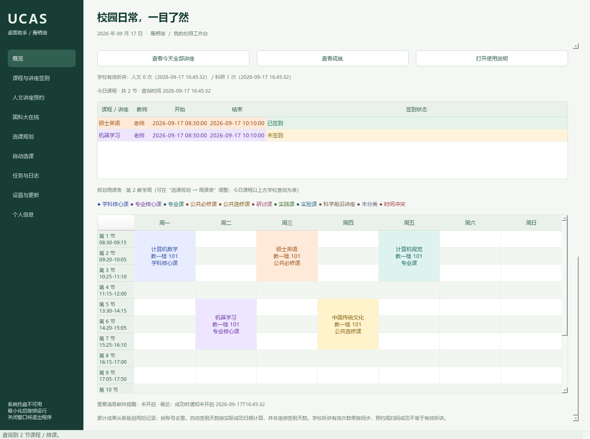

# 仪表盘、状态颜色与邮件提醒（v0.3.2）

## 概览怎样使用

概览卡片每 5 秒读取本机任务状态。它分别显示“计划已启用”“当前任务运行中”，例如每天 08:00 的签到计划可以已启用，但今天的任务已经结束。慕课、自动选课卡片显示对应进程是否在运行；是否完成学校要求，以任务结果与学校页面为准。

顶部的四个数字展示累计成果，下方卡片用大字突出当前状态，再列出计划、日程与查询时间。默认背景使用略深的柔和配色，手动设置过的卡片颜色保留；要使用整套新默认颜色，可在“自定义概览”中恢复默认布局（也会重置显隐与信息量）。

点击 **一键刷新全部信息**，会查询今日课程、轻新课堂已选课程、人文和科研讲座列表、两类有效听讲次数，并读取本机计划、规划、成果和邮件状态。查询不会提交报名或签到，已选同步仅更新本地规划状态。界面留在概览，点击 **查看刷新明细** 查看七项进度；单项失败保留上次结果，并明确标注未更新。讲座任务正忙时最多等候两分钟，不中断它。应用每五秒更新本机状态，不代表每五秒请求学校。

点击 **自定义概览**，可以：

- 单独显示或隐藏每张卡片，隐藏不停止其任务，左侧模块入口始终保留。
- 选择简洁（主要状态）、标准（两项详情）或详细（全部状态）；鼠标悬停可看完整文字。
- 调整各卡片背景色，文字自动选择深色或白色。
- 显示/隐藏累计成果、今日课程、规划周课表、学校听讲次数和邮件状态。
- 保存到本机，重启后恢复；也可一键恢复默认布局。

一键刷新中的 **今日课程** 项查询轻新课堂；每日自动签到任务查到的课表也会同步到概览。已签到为绿色，未签到为浅黄色；学校确认新的签到成功后同步更新。

一键刷新中的 **人文 / 科研讲座列表** 项只查询学校列表，不会报名或签到。两张讲座卡片显示今日名称、时间、地点和最近查询时间；**查看今天全部讲座** 打开可复制表格。人文定点轮询和科研时间表查询也会更新对应缓存。保留所有校区的日程用于查看，自动报名仍仅接受雁栖湖。当前读取学校当前列表页；分页之外的场次不声称已查询。未查到会写“当前列表未见今日安排”，不会将未查询当成无讲座。

主页规划周课表采用与选课规划一致的“13 节 × 7 天”网格，连续节次合并为课程块，并显示类别图例。课程颜色与规划共用同一套映射，时间冲突仍以红色和文字提示。今日课程也按类别着色，最后一列独立保留绿色已签到 / 浅黄色未签到；无法从本地课程库唯一确定类别时用灰色未分类，不凭课程名称猜测。

规划周课表使用“选课规划 → 周课表”选定的教学周，不凭日期猜测开学周次；今日实际课表以上方轻新课堂查询为准。

一键刷新中的 **有效听讲次数** 项读取人文和科研“报名及听课记录”页的统计信息，保留查询时间，解析失败时保留旧值并报告错误。预约次数、扫码成功次数与学校有效听讲次数各自独立。

## 状态颜色与复制

- 签到表：绿色已签到、浅黄色未签到，文字状态同时保留。
- 任务表及日志：蓝色运行、绿色正常结束或成功、红色失败、灰紫色停止、黄褐色等待/重试。脚本正常结束不代表本轮有报名成功。
- 大多数说明和状态文字支持鼠标选中复制；表格选中行后按 **Ctrl+C**，或右键“复制所选行”，得到制表符分隔的文本，可粘贴到 Excel。任务日志可直接选择复制。

## 发件邮箱与收件邮箱

进入 **个人信息**：

1. 在 **发件端** 填写自己的 QQ / Foxmail 或国科大邮箱。
2. 在授权码栏填写对应邮箱的 SMTP 授权码或客户端专用密码，编辑后使用 Windows DPAPI 加密保存在本机。
3. 在 **收件邮箱** 填希望接收提醒的地址。例如用 QQ 发信、国科大邮箱收信。收件端只需地址，无需密码。
4. 点击 **检测账号密码**，只检查发件端登录，不发送邮件。
5. 点击 **发送测试邮件到收件邮箱**，检查收件箱和垃圾邮件目录。服务器接受邮件不等于已投递进收件箱。
6. 勾选 **启用邮件提醒**，再选择需要提醒的类型，设置自动保存。

| 发件端 | 服务器 | 加密端口 | 凭据 |
|---|---|---|---|
| QQ / Foxmail | smtp.qq.com | 465 / SSL | 邮箱设置中启用 SMTP 后取得的授权码 |
| 国科大 | mail.cstnet.cn | 465 / SSL | 邮箱密码或启用双因素认证后的客户端专用密码 |

QQ 邮箱在网页邮箱设置中开启客户端 SMTP 服务并生成授权码；界面路径可能随邮箱版本调整，参见 [QQ 邮箱帮助](https://service.mail.qq.com/)。参数与授权码说明见 [腾讯官方 Email 连接器文档](https://cloud.tencent.com/document/product/1270/55456)。国科大配置见 [学校 SSL 邮件通知](https://onestop.ucas.ac.cn/home/infob/711aa398-7c28-4edb-8359-78f841554ee3/2) 和 [客户端专用密码说明](https://onestop.ucas.ac.cn/Content/Upload/2022/11/4.pdf)。本程序验证服务器证书，不降低到明文连接。

### 邮箱登录或发送失败怎么办

SMTP 是 App 用来发邮件的服务。收件邮箱只负责接收，不需要开启 SMTP。

QQ 发件端先登录 [QQ 网页邮箱](https://mail.qq.com/)，在“设置 → 账户”或“账号与安全”中找到 POP3/IMAP/SMTP 服务，按提示开启并生成授权码。在 App 的发件端填写 QQ 邮箱地址与授权码，不能用 QQ 登录密码代替。界面名称可能变化，可参考上方腾讯官方说明。不要把授权码放到反馈日志或公开仓库。

- **登录失败 / SMTP 535**：核对发件邮箱和授权码是否对应、服务是否启用；若邮箱提示临时限制，稍后再试。
- **未发送：连接 / 认证阶段失败**：此时尚未提交邮件，检查网络和配置后可手动重试。
- **发送结果未确认**：连接在提交时中断，先查看收件箱和垃圾邮件，再决定是否重发，避免重复。
- **服务器已接受发送**：服务器已确认接收，仍需收件端核对实际投递；后续退出连接失败不会覆盖这个结果。

### 哪些消息提醒

每一项均可勾选或忽略，总开关默认关闭：

- **人文讲座预约成功**：学校明确返回 registered 后发送，已预约、预览、失败不算成功。
- **选课成功**：选课流程确认新提交成功后发送，仍需在 SEP 核对预选及审核要求。
- **任务失败 / 有未完成项**：任务退出失败时发送；包括未抢到、登录/网络失败、慕课仍有未完成项等，具体原因在本机日志。手动停止、仅预览和账号检测不发送。定点讲座/每日签到计划同一模块同一天最多一封失败提醒，避免重复轰炸。
- **慕课本轮任务结束**：仅说明本轮脚本正常退出，不代表课程通过，不自动完成考试或作业。
- **签到成功**：学校接口明确确认后发送，默认不勾选。

队列持久化且按事件去重。通知关闭时发生的事件不在以后补发；已经排队、尚未发送的消息会按发送时的总开关和分类开关处理。发送中断或结果不明确时不自动重试，防止重复；核对收件箱后可点击 **核对收件箱后重发未确认通知**。重发使用当前的发件端和收件地址。概览显示最近的通知状态。邮件不包含密码、Cookie 或完整任务日志。

## 累计成果和成就

从新版启用后开始，按学校账号持久保存：自动签到天数、自动签到次数、明确成功的讲座预约与选课数量。重启、重复日志不会重复累计；手动扫码不计入自动签到天数，已签到后跳过也不计数。没有根据旧日志补造历史数量。

第一次签到、10/50 次签到、7/30 天签到、1/5 场预约、1/5 门选课会解锁对应成就。提示为非阻塞小窗或托盘消息，不会暂停任务；个人信息中可以关闭弹窗，概览 **查看成就** 仍可查询。

## 发现雁栖湖讲座却未报名

先看日志的 `lecture.decision`，它会给出每场的日期、地点和筛选原因。**筛选时段指讲座开始时间，不是报名开放时间。** 例如下午 15:30 开始的雁栖湖讲座会被 `18:00–22:00` 排除。

新安装默认全天、全部星期。升级保留已有筛选；要包括下午讲座，在人文讲座页勾选 **全天**，保留需要的星期，再点 **保存定点计划**。已手动预约的场次会跳过。切换全天不会放开中关村/玉泉路，也不会绕过学校配额。

## 正在运行慕课时升级

继续让旧版任务运行。等任务结束后，在托盘右键 **退出程序**，再升级并重新启动。新版不能接管旧进程里的任务，也不会对旧进程补发通知。请勿同时运行两个目录中的自动化实例。
